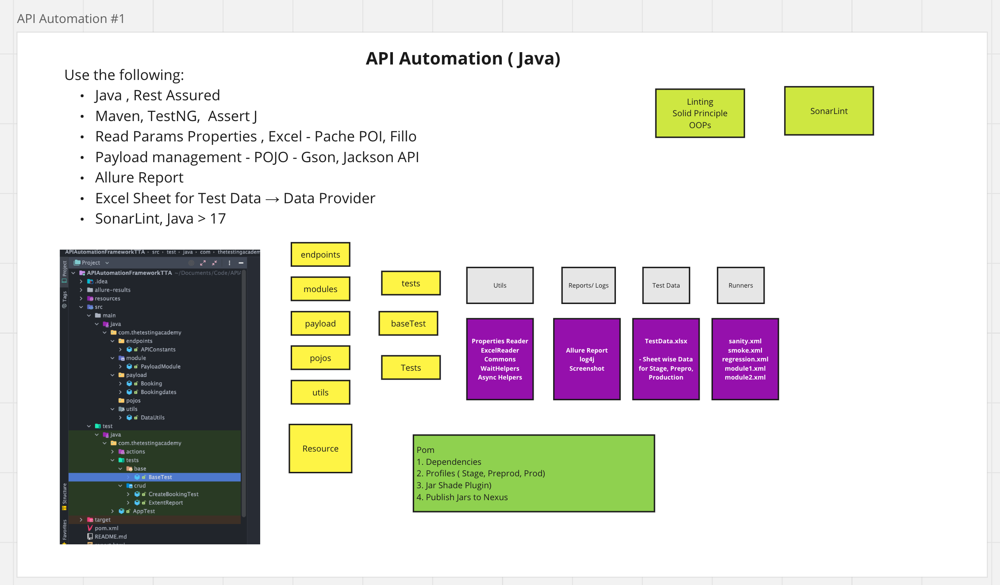
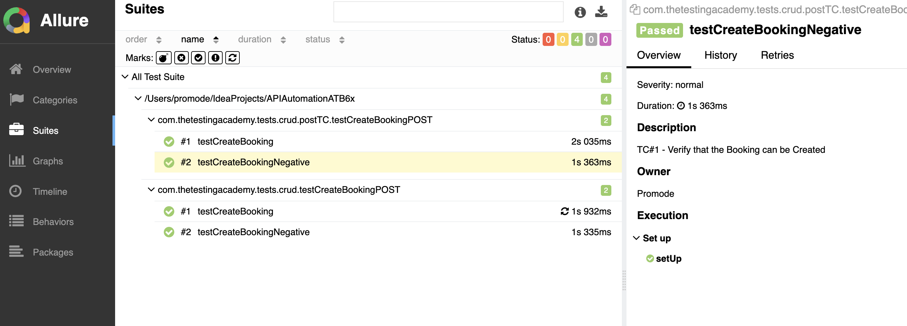

API Automation RestAssured (in Java)

Author - Pramod Dutta
API Automation Framework with the CRUD of Restful Booker

mvn test -Dsurefire.suiteXmlFiles=testng.xml

Tech Stack
Java ( JDK > 21)
Rest Assured
Apache POI, TestNG, Maven.
AssertJ (Advance assertions)
Jackson and GSON
Log4j
Allure Report
Full Folder Structure(Hybrid) Framework.
Jenkins File
API Framework Important Components
Screenshot 2024-06-29 at 12 44 29

Run

Basic Create Test
Install Maven
add config to run the suite or testng
<plugins>
<plugin>
<groupId>org.apache.maven.plugins</groupId>
<artifactId>maven-surefire-plugin</artifactId>
<version>3.3.0</version>
<configuration>
<suiteXmlFiles>
<suiteXmlFile>${suiteXmlFile}</suiteXmlFile>
</suiteXmlFiles>
</configuration>
</plugin>
</plugins>
</build>
to pom.xml

mvn clean test -DsuiteXmlFile=testng.xml

Parallel Execution
To run tests in parallel, add the parallel attribute to your testng.xml file:

<suite name="All Test Suite" parallel="methods" thread-count="2">

Integration Test (Create BookinG and Create Token , Update and Delete Booking)
mvn clean test -DsuiteXmlFile=testng-integration.xml

Allure Report Generated.
allure serve allure-results/

image

Certainly! I'll guide you through the steps to install Allure and generate a report for a Java project using TestNG. Here's a step-by-step process:

1. Install Allure
   First, you need to install Allure Command Line Tool. If you're using a Mac, you can use the following Brew command:

brew install allure
For other operating systems, please refer to the official Allure documentation for installation instructions.

2. Set up your Java project
   Ensure you have a Java project set up with TestNG. If not, create a new Maven project and add the necessary dependencies.

3. Add Allure dependencies
   Add the following dependencies to your pom.xml file:

<dependency>
    <groupId>io.qameta.allure</groupId>
    <artifactId>allure-testng</artifactId>
    <version>2.13.0</version>
</dependency>
4. Configure Allure in your project
Update the <build> section of your pom.xml to include the Allure Maven plugin:

<build>
    <plugins>
        <plugin>
            <groupId>io.qameta.allure</groupId>
            <artifactId>allure-maven</artifactId>
            <version>2.10.0</version>
            <configuration>
                <reportVersion>2.13.0</reportVersion>
            </configuration>
        </plugin>
    </plugins>
</build>
5. Run your tests
Execute your TestNG tests using Maven:

mvn clean test

This will run your tests and generate the Allure results in the target/allure-results directory.

6. Generate the Allure report
   After running your tests, use the following command to generate the Allure report:

allure generate target/allure-results --clean -o allure-report
This command will create an allure-report folder containing the generated report.

7. View the report
   To view the report, you can use the following command:

allure open allure-report
This will start a local web server and open the report in your default browser.

Additional Tips
You can use the @Severity annotation to indicate the importance of your tests.
Allure supports attaching screenshots, which can be useful for UI tests.
For more advanced configurations and features, refer to the official Allure documentation.
By following these steps, you should be able to successfully install Allure, run your TestNG tests, and generate a comprehensive Allure report for your Java project.

Try these Cases also
POSTMAN Assignments 
Assignment 1

Create the Collections for the This Test cases :

App - Restful Booker with(Auth)

Create a Booking, Update the Booking Name, Get the Booking by Id and verify.
Create a Booking, Delete the Booking with Id and Verify using GET request that it should not exist.
Get an Existing Booking from Get All Bookings Ids , Update a Booking and Verify using GET by id.
Create a BOOKING, Delete It
Invalid Creation - enter a wrong payload or Wrong JSON.
Trying to Update on a Delete Id
Test for the Single Req

Response
Status Code
Headers
———

Create Collection

RestfulBooker CRUD operation.
Add from Snippets , Test cases
Integration Scenarios (Hard Coded)